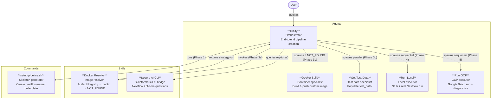

# Ghobrial Lab Pipeline Agents — System Diagram

```mermaid
flowchart TD
    user([User])

    subgraph agents["Agents"]
        trinity["**Trinity**\nOrchestrator\nEnd-to-end pipeline creation"]
        docker-build["**Docker Build**\nContainer specialist\nBuild & push custom image"]
        get-test-data["**Get Test Data**\nTest data specialist\nPopulate test_data/"]
        run-local["**Run Local**\nLocal executor\nStub + real Nextflow run"]
        run-gcp["**Run GCP**\nGCP executor\nGoogle Batch run + diagnostics"]
    end

    subgraph skills["Skills"]
        docker-resolve["**Docker Resolve**\nImage resolver\nArtifact Registry → public → NOT_FOUND"]
        seqera["**Seqera AI CLI**\nBioinformatics AI bridge\nNextflow / nf-core questions"]
    end

    subgraph commands["Commands"]
        setup-pipeline["**setup-pipeline.sh**\nSkeleton generator\nCreate nextflow-name/ boilerplate"]
    end

    user -->|invokes| trinity
    trinity -->|"runs (Phase 1)"| setup-pipeline
    trinity -->|"invokes (Phase 3a)"| docker-resolve
    docker-resolve -->|returns strategy+url| trinity
    trinity -->|"spawns if NOT_FOUND (Phase 3b)"| docker-build
    trinity -->|"spawns parallel (Phase 3c)"| get-test-data
    trinity -->|"spawns sequential (Phase 4)"| run-local
    trinity -->|"spawns sequential (Phase 5)"| run-gcp
    trinity -->|"queries (optional)"| seqera
```
